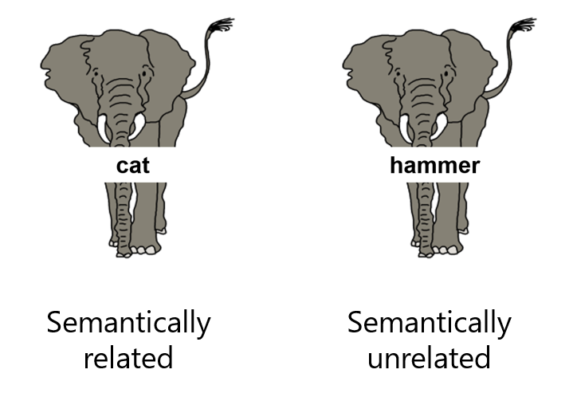

```{r setup, include = FALSE}
knitr::opts_chunk$set(echo = TRUE, message = FALSE, warning = FALSE)
```

# Load required packages

```{r, results = "hide"}
rm(list=ls())

library("openxlsx")
library("Rmisc")
library("tidyverse")
library("lme4")
library("car")
library("MASS")
library("scales")
library("lmerTest")
library("sjmisc")
library("sjPlot")
library("ggsignif")
library("RColorBrewer")
```

# Load the data

Data that we will be using today is publicly available [on my OSF page](https://osf.io/g7ftz/) as well as [on GitHub](https://github.com/mariakna/MQ-eResearchTraning--G-LMEmodels).

Download the file *pwiExp.xlsx*, save it in a directory of your choice, make this directory your working directory by using the command `setwd()` and load the file as shown below:

```{r}
data <- read.xlsx("pwiExp.xlsx", sheet = 1)
```

This file contains data from a picture-word interference task. In this task, German native speakers named (in German) pictures of familiar concepts (e.g., elephant) with superimposed written word distractors. The distractors were either semantically related (e.g., 'cat') or unrelated (e.g.'hammer') to the depicted concepts. The distractors were either German words, or novel words that the participants had learned earlier, or unknown pseudowords. 

<center>
{width=300px}
</center>

**Hypotheses 1 & 2:**

- Compared to semantically unrelated German distractors, German distractors from the same semantic category will slow picture naming response times
- Compared to unknown pseudowords, German semantically unrelated distractors will slow picture naming response times

The data we just loaded contains the following information:

- `Subj`: Participant ID (there were 60 participants in total)
- `List`: Which list the participant received (1-5)
- `ItemType`: Experimental or filler (this file only contains experimental items)
- `Cond`: Condition. This a factor with 5 levels: `SemRelG` (semantically related German), `SemUnRelG` (semantically unrelated German), `SemRelN` (semantically related novel), `SemUnRelN` (semantically unrelated novel), `Baseline` (unknown pseudowords as distractors)
- `TargetCat`: semantic category of the depicted concept (target)
- `DistCat`: semantic category of the distractor
- `Dist`: distractor word
- `DistLC`: Learning context of the distractor: `Fam` stands for German word, `Untrained` stands for unknown pseudowords, `CRel` stands for catgeorically related, `UnRel` stands for categorically unrelated (more on that later)
- `TargetAnswer`: correct picture name (in German)
- `Response`: participant's response
- `Accuracy`: `0` for incorrect responses, `1` for correct responses
- `RT`: response times


